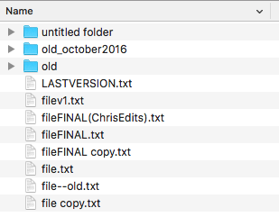

The point of this post is to give an overview of git and introduce some basic terms that will be helpful when learning git properly, and using it in personal or shared projects. I'm going to try to keep it light, and, while I might brush over some details a bit quickly, I hopefully won't leave you mystified. This is not meant to be a tutorial, and it will largely ignore several more complicated concepts, but it might prepare you to learn more about git. As much as possible, I will try to use layman's terms if we have not yet introduced a technical term of vocabulary.

## What is git and what problem does it solve?

Git is a version control system. That is to say, it's a tool that helps keep track and manage changes to data over time. It solves the problem that most people working on a project longterm have encountered: how do we incrementally improve our work (create "versions") without losing our previous efforts, and how do we collaborate and share these projects with others in a sensible manner?

I think that anyone that has worked on a computer long enough has ended up with a folder whose contents resemble at least a bit like this:

What git proposes is a solution in which, instead of having several competing, strangly named, versions of the same file visible at any given moment, you have access to the timeline (`history`) of the modifications to the file, presented as a series of incremental savepoints (`commits`)[^1].

We can visualize this history as a summarizing table of contents

| id  | date       | message                                     | files changed | Author |
| --- | ---------- | ------------------------------------------- | ------------- | ------ |
| 1   | 10-01-2019 | Created file                                | file.txt      | Dave   |
| 2   | 10-02-2019 | Added some text                             | file.txt      | Dave   |
| 3   | 10-02-2019 | Added some more text                        | file.txt      | Dave   |
| 4   | 10-03-2019 | Rewrote the introduction                    | file.txt      | Dave   |
| 5   | 10-10-2019 | Translated the latin in the third paragraph | file.txt      | Dave   |
| 6   | 10-12-2019 | Deleted the minotaur                        | file.txt      | Dave   |
| 7   | 10-12-2019 | Wrote the conclusion                        | file.txt      | Dave   |
| 8   | 11-01-2019 | Version 1 ready                             | file.txt      | Dave   |
| 9   | 11-20-2019 | Revised the introduction                    | file.txt      | Chris  |

If at some point, you wanted to check out what the file looked like before we deleted the minotaur, we could just check out the entry #5.

Git additionally provides us with ways of making it easy to share to a centralized repository where others can either pull down a copy of the project or contribute their own changes and push them up to the repository.

Finally, git has built-in functionalities to help with problems you might encounter: building isolated workspaces/versions of your project (`branches`), managing the timeline by removing or undoing a specific modifications/savepoints, or to resolve any problems (`conflicts`) that arise when two people try to edit the same part of the same file, to name a few. Git is a very rich organalizational tool, but it also has enough simple use-cases for a basic user to take advantage of it with just a little introduction.

## Should I use it on my project? I'm working all alone, and I'm not sharing it.

Yes. A big, unsarcastic and unequivocal "yes". Even if your project isn't code. It's a good habit to have, and one day, you might want to undo something or take a look at what you did along the way. Without a version control system, you'll either be disorganized or working too hard on organizing your project's history.

## Basic terms

Here are some basic terms that you'll encounter in learning git. I'd argue that these are the minimum needed to understand git enough to use git at a basic level.

### Repository (repo)

A git repository is a collection of files, usually a directory which uses git to track its changes. Think of it as a capsule, a package, or an archive (like a `.zip` archive). A `remote` repository is the centralized repository which collaborators use as the basis for their work &ndash; i.e. the single source of truth. This is often a repository managed by a service like Github or bitbucket.

### Commit

A commit is a single snapshot or savepoint of the data in a `repository`. Each row in the table above is a commit.

e.g.
| | | | | |
--- | --- | --- | --- | ---
1 | 10-01-2019 | Created file | file.txt | Dave

A commit notes the differences between this `commit` and the previous `commit` along with a message, a unique id/reference, the date, author, etc.

### Push

When working with a centralized repository (a `remote`), you will `push` your changes (`commit(s)`) to the remote. This will make your changes available to everyone else in the project to share their work on.

### Pull

When working with a centralized repository (a `remote`), your local version of the repository is not necessarily be up-to-date with the `remote` version. In order get your local repository up to date, you'll need to `pull` the changes down to your work, applying the remote commits to your repository.

## An Example Without Code or Commands

A quick and basic example:

Two people are working on a project. Let's call them Dave and Chris. Dave creates a `repository` on his laptop (local machine) and gets to work:

- He creates a file called `file.txt`
- He writes `Hello world` in `file.txt` and saves it.

He's pretty happy with his work, and he decides to make a savepoint, so he `commit`s his work. He adds the message "Initiated the project. Created file.txt"

The next day, Dave looks at his work, and he decided that it can be improved.

- He changes the content of the file to `Hello, world` and saves his work
- He realizes he forgot a period and changes the content of the file to `Hello, world.` and saves.

He's done with the changes, so he makes another `commit` with the message "Added punctuation."

He wants to share the project so far with Chris, so he creates a centralized, `remote` repository on GitHub. The remote is currently empty. He `push`es his two `commit`s up to the `remote`. Now the GitHub `repo` ("repo" is short for "repository") is up-to-date with Dave's local `repo`.

Chris takes a look and he wants to make some changes to share with Dave. He creates an empty `repo` on his local machine, and `pull`s the content down from GitHub onto his machine. Now his work is up-to-date with GitHub and Dave.

He makes his changes:

- He replaces `file.txt` to read `Hello, world!` and saves his work.
- He creates a second file called `fichier.txt`
- He adds the text `Bonjour, monde !` to `fichier.txt` and saves his work

He's satisfied, so now, he makes a `commit` with the message "Updated message and added French version". He wants to share his changes immediately, so he `push`es his work up to GitHub.

Now Dave can `pull` down the `repo` from GitHub, and so on.

## Conclusion

This post was not the most technical post, in fact, there's not a single command! But, hopefully it provides a good overview of why you would want to use git and what that could look like.

The situation in our example is very basic, and it doesn't cover a lot of issues that you might run into in real life[^2]. But, rest assured that git is complex enough to handle pretty much any weird scenario you can throw at it.

In order to keep this post light (respecting both your time and mine), that's going to be it for now. I hope to develop a few more posts in this series introducing additional concepts (in a similar manner), along with the actual terminal commands that you can use to manipulate a git repository[^3].

## Further reading and experiences

- [An interactive online tutorial](https://www.katacoda.com/courses/git/1)
- [The git handbook](https://guides.github.com/introduction/git-handbook/)
- [The github intro to git](https://guides.github.com/activities/hello-world/)
- [The git book](https://git-scm.com/book/en/v2)

[^1]: Note of interest: git saves the _differences_ between the previous snapshot of the project and the new snapshot at each savepoint (`commit`), and, in doing so, reduces the size of the project. For example, imagine that you have a 10 kilobyte text file, but the last line of the file was missing a period, so you make a new version, adding a period, and then create a snapshot. The snapshot would just be instructions to a single character to the last line. That means, that even though you have 2 versions of a 10kb file, the total size will be much less than 10kb!
[^2]: (Imagine for example, that after Chris pulled the repo down from GitHub, Dave quickly made a commit which changed the text to "Hello, world?" and pushed it up. What would happen when Chris tried to push up his changes??)
[^3]: Note that some people prefer to use the command line to deal with their git repositories, like I do, others use a graphical user interface (GUI) such as [GitKraken](https://www.gitkraken.com/) or the plugins built in their text editor like VSCode. I'd suggest learning in the command line as typing in the commands will help you memorize them. Afterwards, do whatever makes you look the coolest and helps you be the most productive.
