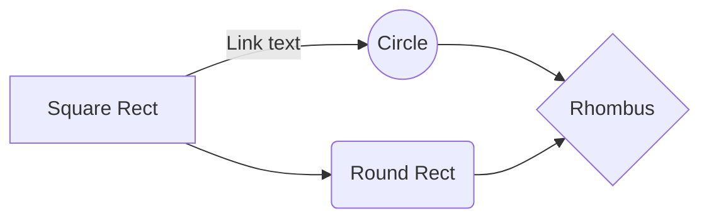
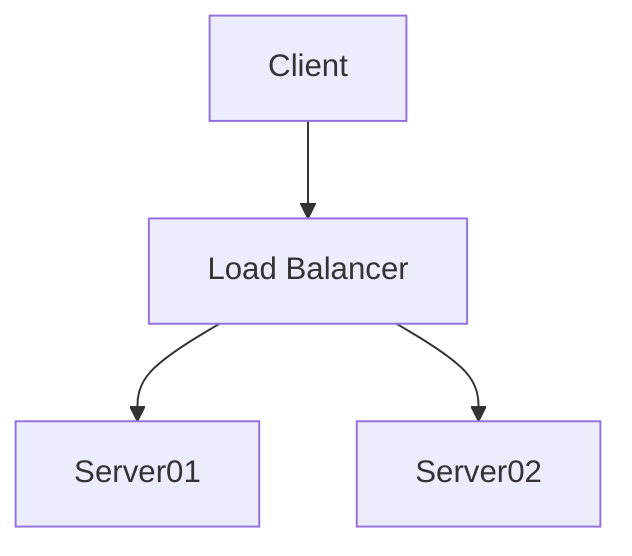
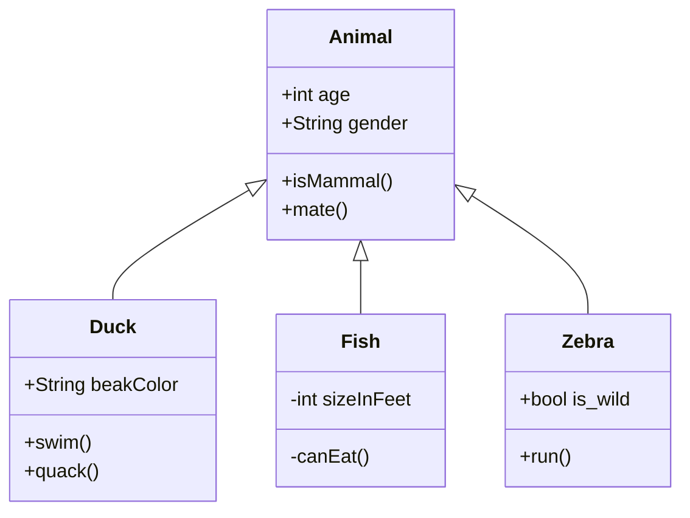
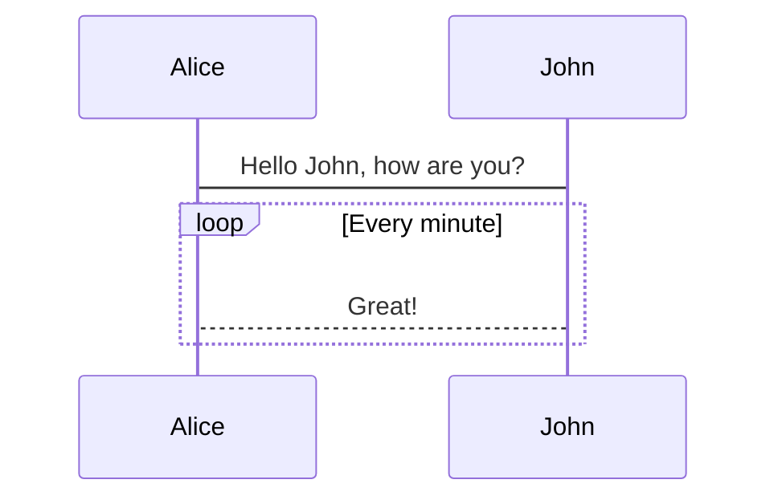
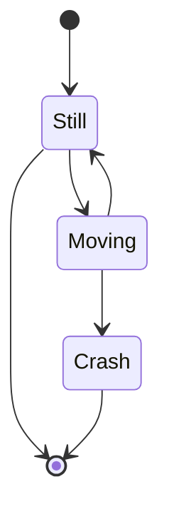

This is just a quick note to talk about a plugin we just added to [thread.house](https://www.thread.house) which makes adding basic flowcharts to posts very easy.

The plugin is called [gatsby-remark-mermaid](https://www.gatsbyjs.org/packages/gatsby-remark-mermaid/) and it helps you make flowcharts and graphs quickly in your markdown files. For a technical blog, I think it will end up paying off.

## Overview

[Mermaid](https://mermaid-js.github.io/mermaid) is a javascript library which transforms a special syntax into charts and graphs, ranging from complicated simple to complicated. You put in some text, and Mermaid produces an readable and easy-on-the-eye SVG image of your data. Mermaid covers a lot of different types of diagrams: flow charts, sequence diagrams, class diagrams (heirarchy/inheritance), state diagrams, Gantt diagrams, pie charts, and even git-graphs. To top it off their [documentation](https://mermaid-js.github.io/mermaid) is exceptional.

## Examples

I'll let the plugin talk for itself. The following diagrams were taken directly from the [Mermaid documentation](https://mermaid-js.github.io/mermaid) and pasted into this blog post. Some notes on basic usage and installation (in a Gatsby project) follow.

### Flowchart (Left to Right)

````md

````

Renders


### Flowchart (Top Down)

````md

````

Renders


### Class diagrams

````md

````

Renders


### Sequence

````md

````

Renders


#### State diagram

````md

````

Renders


### Others?

While all the functionality works out-of-the box, there's still a little work to do to get the styles of the git-graph, gantt diagram, and the pie chart playing nicely with `thread.house`'s styles.

## Basic Usage

When writing in your markdown file, start a new mermaid code block using 3 backticks:

````md
```mermaid
  # Mermaid syntax goes here
```
````

Then you just start working on your graph. The graph type will be your first line, `stateDiagram`, `graph TD`, `graph LR`, `pie`, etc. and then the properties of the graph, followed by the relationships. The syntax is pretty easy to read, and the docs are clear.

### Hot tip 🔥:

Install the [Markdown Preview Mermaid](https://marketplace.visualstudio.com/items?itemName=bierner.markdown-mermaid) extension for VSCode help you preview the graph as you're working on it.

## Installation

Installing this package in a Gatsby project is easy.

Assuming you have `gatsby-transformer-remark` already installed for a markdown blog, you can install the package using:

`yarn add gatsby-remark-mermaid` or `npm i -S gatsby-remark-mermaid`

in the command line from the gatsby project directory to add the dependency to package.json and download the package to the node_modules directory.

Once that's done, you just need to add the plugin to `[PROJECTROOT]/gatsby-config.js`:

```js
module.exports = {
  // other config...
  plugins: [
    // other plugins
    {
      resolve: `gatsby-transformer-remark`,
      options: {
        plugins: [
          `gatsby-remark-mermaid`,
          // other plugins,
        ],
      },
    },
  ],
}
```

**Note:** The Mermaid plugin transforms mermaid codeblocks and turn them into SVG files, so it should be included in the `plugins` array of the `gatsby-transformer-remark` object before anything else that transforms codeblocks, such as `gatsby-remark-prismjs`; these other plugins might transform the codeblocks into html code which Mermaid won't recognize.

Happy writing!
